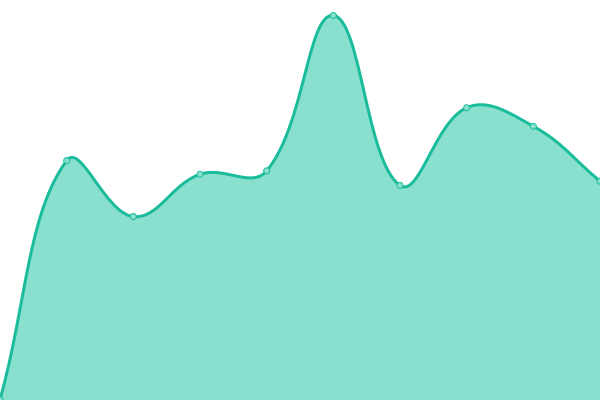
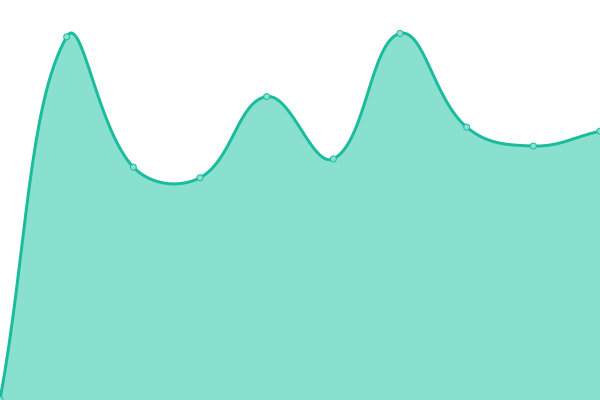
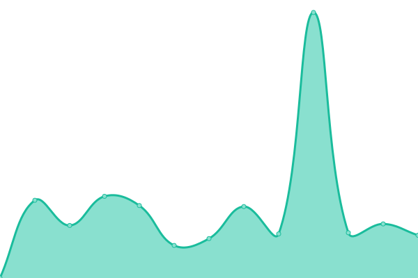
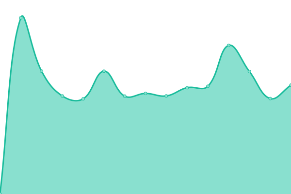

# [📈 Live Status](https://ub-unibe-ch.github.io/ub-public-services-status): <!--live status--> **🟩 All systems operational**

This repository contains the open-source uptime monitor and status page for [University Library - University of Bern](https://www.unibe.ch/universitaet/dienstleistungen/universitaetsbibliothek/ub/index_ger.html), powered by [Upptime](https://github.com/upptime/upptime).

<!--start: status pages-->
<!-- This summary is generated by Upptime (https://github.com/upptime/upptime) -->
<!-- Do not edit this manually, your changes will be overwritten -->
<!-- prettier-ignore -->
| URL | Status | History | Response Time | Uptime |
| --- | ------ | ------- | ------------- | ------ |
|  [Agenda](https://agenda.ub.unibe.ch/) | 🟩 Up | [agenda.yml](https://github.com/ub-unibe-ch/ub-public-services-status/commits/HEAD/history/agenda.yml) | 

 1365ms
     
 | 

<a href="https://ub-unibe-ch.github.io/ub-public-services-status/history/agenda">83.99%</a>
    

|  [Berner Ortsgeschichten](https://berner-ortsgeschichten.ub.unibe.ch/) | 🟩 Up | [berner-ortsgeschichten.yml](https://github.com/ub-unibe-ch/ub-public-services-status/commits/HEAD/history/berner-ortsgeschichten.yml) | 

 2447ms
     
 | 

<a href="https://ub-unibe-ch.github.io/ub-public-services-status/history/berner-ortsgeschichten">99.48%</a>
    

|  [BERNHIST](https://bernhist.ch/) | 🟩 Up | [bernhist.yml](https://github.com/ub-unibe-ch/ub-public-services-status/commits/HEAD/history/bernhist.yml) | 

 656ms
     
 | 

<a href="https://ub-unibe-ch.github.io/ub-public-services-status/history/bernhist">99.48%</a>
    

|  [Biblio (File Download)](https://biblio.unibe.ch/) | 🟩 Up | [biblio-file-download.yml](https://github.com/ub-unibe-ch/ub-public-services-status/commits/HEAD/history/biblio-file-download.yml) | 

 1308ms
     
 | 

<a href="https://ub-unibe-ch.github.io/ub-public-services-status/history/biblio-file-download">99.48%</a>
    

|  [Billing](https://billing.ub.unibe.ch/) | 🟩 Up | [billing.yml](https://github.com/ub-unibe-ch/ub-public-services-status/commits/HEAD/history/billing.yml) | 

 952ms
     
 | 

<a href="https://ub-unibe-ch.github.io/ub-public-services-status/history/billing">99.48%</a>
    

|  [Collection Ryhiner](https://ryhiner.ub.unibe.ch/) | 🟩 Up | [collection-ryhiner.yml](https://github.com/ub-unibe-ch/ub-public-services-status/commits/HEAD/history/collection-ryhiner.yml) | 

 909ms
     
 | 

<a href="https://ub-unibe-ch.github.io/ub-public-services-status/history/collection-ryhiner">99.48%</a>
    

|  [DigiBern](https://digibern.ch/) | 🟩 Up | [digi-bern.yml](https://github.com/ub-unibe-ch/ub-public-services-status/commits/HEAD/history/digi-bern.yml) | 

 952ms
     
 | 

<a href="https://ub-unibe-ch.github.io/ub-public-services-status/history/digi-bern">98.38%</a>
    

|  [IIIF Server](https://iiif.ub.unibe.ch/) | 🟩 Up | [iiif-server.yml](https://github.com/ub-unibe-ch/ub-public-services-status/commits/HEAD/history/iiif-server.yml) | 

 898ms
     
 | 

<a href="https://ub-unibe-ch.github.io/ub-public-services-status/history/iiif-server">100.00%</a>
    

|  [Literapedia Bern](https://literapedia-bern.ch/) | 🟩 Up | [literapedia-bern.yml](https://github.com/ub-unibe-ch/ub-public-services-status/commits/HEAD/history/literapedia-bern.yml) | 

 1132ms
     
 | 

<a href="https://ub-unibe-ch.github.io/ub-public-services-status/history/literapedia-bern">99.48%</a>
    

|  [MetaEQ](https://metaeq.ub.unibe.ch/) | 🟩 Up | [meta-eq.yml](https://github.com/ub-unibe-ch/ub-public-services-status/commits/HEAD/history/meta-eq.yml) | 

 1458ms
     
 | 

<a href="https://ub-unibe-ch.github.io/ub-public-services-status/history/meta-eq">99.48%</a>
    

|  [PHBern Teacher](https://phbern-teacher.ub.unibe.ch/) | 🟩 Up | [ph-bern-teacher.yml](https://github.com/ub-unibe-ch/ub-public-services-status/commits/HEAD/history/ph-bern-teacher.yml) | 

 1231ms
     
 | 

<a href="https://ub-unibe-ch.github.io/ub-public-services-status/history/ph-bern-teacher">99.48%</a>
    

|  [Research Databases](https://databases.ub.unibe.ch/) | 🟩 Up | [research-databases.yml](https://github.com/ub-unibe-ch/ub-public-services-status/commits/HEAD/history/research-databases.yml) | 

 1288ms
     
 | 

<a href="https://ub-unibe-ch.github.io/ub-public-services-status/history/research-databases">99.48%</a>
    

|  [Room Reservation](https://raumreservation.ub.unibe.ch/) | 🟩 Up | [room-reservation.yml](https://github.com/ub-unibe-ch/ub-public-services-status/commits/HEAD/history/room-reservation.yml) | 

 988ms
     
 | 

<a href="https://ub-unibe-ch.github.io/ub-public-services-status/history/room-reservation">99.48%</a>
    

|  [URN Resolver](https://urn.ub.unibe.ch/) | 🟩 Up | [urn-resolver.yml](https://github.com/ub-unibe-ch/ub-public-services-status/commits/HEAD/history/urn-resolver.yml) | 

 710ms
     
 | 

<a href="https://ub-unibe-ch.github.io/ub-public-services-status/history/urn-resolver">99.48%</a>
    

|  [ZMS Publication List](https://publicationlist.ub.unibe.ch/) | 🟩 Up | [zms-publication-list.yml](https://github.com/ub-unibe-ch/ub-public-services-status/commits/HEAD/history/zms-publication-list.yml) | 

 878ms
     
 | 

<a href="https://ub-unibe-ch.github.io/ub-public-services-status/history/zms-publication-list">99.48%</a>
    

<!--end: status pages-->

[**Visit our status website →**](https://ub-unibe-ch.github.io/ub-public-services-status)

## 📄 License

- Powered by: [Upptime](https://github.com/upptime/upptime)
- Code: [MIT](./LICENSE) © [Anand Chowdhary](https://anandchowdhary.com), supported by [Pabio](https://pabio.com)
- Data in the `./history` directory: [Open Database License](https://opendatacommons.org/licenses/odbl/1-0/)
